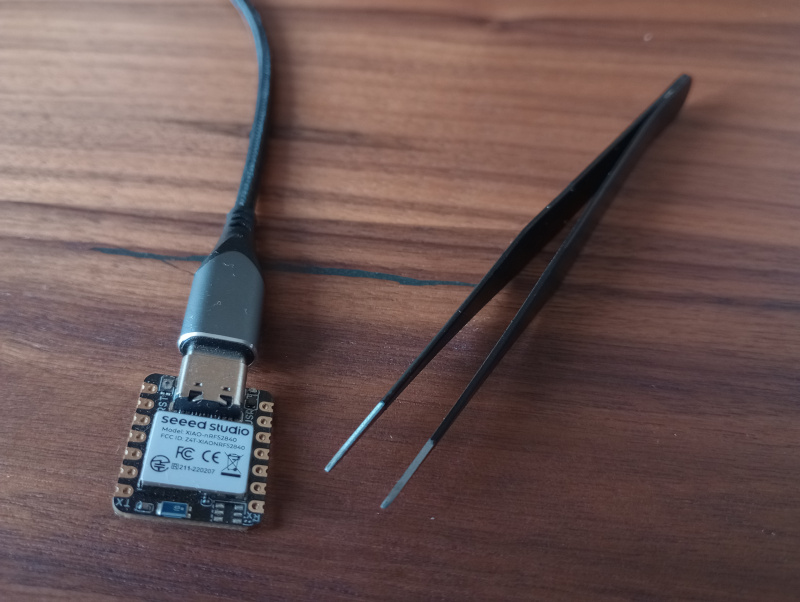
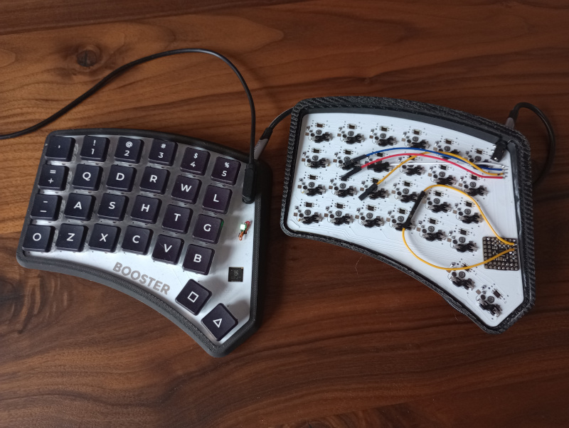
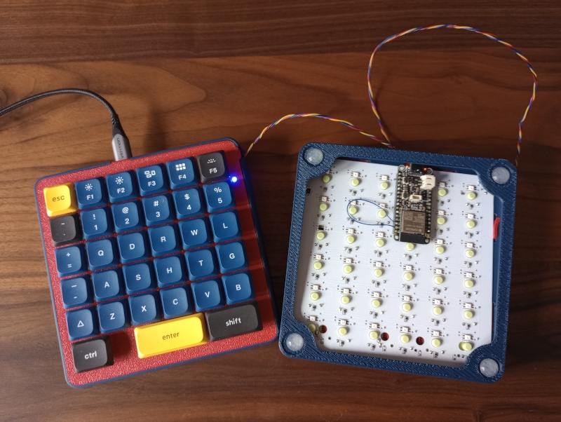

@page p_3 3 Get Started
@tableofcontents

@section p_3_1  3.1 Hardware Keypass

<div style="margin-left: 100px;">
  
</div>

``` {.py}
# code.py

import board

from mkx.mkx_central import MKX_Central

from mkx.keys_standard import *
from mkx.keys_modifiers import M_LSFT
from mkx.keys_sequence import SEQ

from mkx.periphery_central import PeripheryCentral
from mkx.interphace_central import InterphaceCentral

keyboard = MKX_Central()

col_pins = (board.D5,)
row_pins = (board.D6,)
hardware_keypass_peryphery = PeripheryCentral("hardware_keypass", col_pins, row_pins)
keyboard.central_periphery = hardware_keypass_peryphery

interphace_central = InterphaceCentral(hardware_keypass_peryphery, 0, 0, 0, 0)
keyboard.add_interface(interphace_central)

# fmt: off

HK = SEQ([M_LSFT(H), E, L, L, O, SPACE, 
          M_LSFT(W), O, R, L, D, SPACE, 
          M_LSFT(M), M_LSFT(K), M_LSFT(X), M_LSFT(N1), ENTER])

keymap = [
    [
        HK,
    ],
]

# fmt: on

keyboard.add_keymap(keymap, 1, 1)
keyboard.run_forever()
```

@section p_3_2  3.2 Booster Keyboard

<div style="margin-left: 100px;">
  
</div>

**Left Keyboard Part (Central)**
``` {.py}
# code.py

import board

from mkx.mkx_central import MKX_Central

from mkx.periphery_central import PeripheryCentral
from mkx.interphace_central import InterphaceCentral
from mkx.interphace_uart import InterphaceUART
from mkx.layer_status_led_rgb_neopixel import LayerStatusLedRgbNeoPixel

from mkx.keys_standard import *
from mkx.keys_modifiers import M_LGUI
from mkx.keys_holdtap import HT
from mkx.keys_layers import MO, TO
from mkx.keys_media import VOLU, VOLD

keyboard = MKX_Central()

col_pins = (board.GP9, board.GP7, board.GP5, board.GP4, board.GP3, board.GP2)
row_pins = (board.GP10, board.GP11, board.GP13, board.GP15, board.GP17)

central_peryphery = PeripheryCentral("booster_l", col_pins, row_pins)
keyboard.central_periphery = central_peryphery

interphace_central = InterphaceCentral(central_peryphery, 0, 0, 5, 4)
keyboard.add_interface(interphace_central)

interphace_right = InterphaceUART("booster_r", None, board.GP1, 11, 0, 6, 4)
keyboard.add_interface(interphace_right)

status_led = LayerStatusLedRgbNeoPixel(board.GP23, brightness=0.015)
status_led.add_layer(0, (0, 255, 0))  # Green
status_led.add_layer(1, (0, 0, 255))  # Blue
keyboard.add_layer_status_led(status_led)

# Shortcuts
DESKTOP = M_LGUI(D)
LOCK = M_LGUI(L)

# Hold Tap
LAY1 = HT(TO(1), MO(1))
LAY0 = HT(TO(0), MO(0))

LCTL_TAB = HT(TAB, LCTRL)
LSFT_SPC = HT(SPC, LSFT)
RALT_BSPC = HT(BSPC, RALT)
LALT_BSPC = HT(BSPC, LALT)

# fmt: off

keymap = [
    [
        GRV,        N1,         N2,         N3,         N4,         N5,         N6,         N7,         N8,         N9,         N0,         BSLS,
        EQL,        Q,          D,          R,          W,          L,          J,          F,          U,          P,          SCLN,       LBRC,
        MINS,       A,          S,          H,          T,          G,          Y,          N,          E,          O,          I,          QUOT,
        LCTL_TAB,   Z,          X,          C,          V,          B,          K,          M,          COMM,       DOT,        SLSH,       RBRC,
        None,       None,       None,       None,       LSFT_SPC,   ENTER,      LAY1,       RALT_BSPC,  None,       None,       None,       None,
    ],
    [
        ESC,        F1,         F2,         F3,         F4,         F5,         F6,         F7,         F8,         F9,         F10,        F11,
        None,       None,       DESKTOP,    PAGE_UP,    None,       LOCK,       None,       BSPC,       UP,         DEL,        None,       F12,
        None,       None,       HOME,       PAGE_DOWN,  END,        None,       None,       LEFT,       DOWN,       RIGHT,      None,       None,
        LCTL_TAB,   Z,          X,          C,          V,          None,       None,       VOLD,       None,       VOLU,       None,       None,
        None,       None,       None,       None,       LSFT_SPC,   ENTER,      LAY0,       LALT_BSPC,  None,       None,       None,       None,
    ]
]

# fmt: on

keyboard.add_keymap(keymap, 12, 5)
keyboard.run_forever()
```

**Right Keyboard Part**

``` {.py}
# code.py

import board

from mkx.mkx_periphery import MKX_Periphery
from mkx.periphery_uart import PeripheryUART


col_pins = (board.GP9, board.GP7, board.GP5, board.GP4, board.GP3, board.GP2)
row_pins = (board.GP10, board.GP11, board.GP13, board.GP15, board.GP17)

peryphery = PeripheryUART("booster_r", col_pins, row_pins, board.GP0, board.GP1)

keyboard = MKX_Periphery(peryphery, debug=True)
keyboard.run_forever()
```

@section p_3_3  3.3 Square Keyboard

<div style="margin-left: 100px;">
  
</div>

**Left Keyboard Part (Central)**

``` {.py}
# boot.py

import board

from mkx.boot_config import boot_cfg

boot_cfg(
    sense=board.D13,  # column
    source=board.D5,  # row
    autoreload=False,
    storage=False,
    usb_id=("MKX Device", "Sq Keyboard"),
)
```
  
``` {.py}
# code.py

import board

from mkx.mkx_central import MKX_Central
from mkx.layer_status_led_rgb_neopixel import LayerStatusLedRgbNeoPixel

from mkx.keys_standard import *
from mkx.keys_modifiers import M_LCTL, M_LGUI
from mkx.keys_media import VOLU, VOLD
from mkx.keys_holdtap import HT
from mkx.keys_layers import TO
from mkx.keys_vim import *

from mkx.periphery_central import PeripheryCentral
from mkx.interphace_central import InterphaceCentral
from mkx.interphace_uart import InterphaceUART

keyboard = MKX_Central()

col_pins = (board.D13, board.D12, board.D11, board.A1, board.A4, board.A3)
row_pins = (board.A2, board.MISO, board.D10, board.D9, board.D6, board.D5)
central_peryphery = PeripheryCentral("sq_l", col_pins, row_pins)
keyboard.central_periphery = central_peryphery

interphace_central = InterphaceCentral(central_peryphery, 0, 0, 5, 5)
keyboard.add_interface(interphace_central)

interphace_right = InterphaceUART("sq_r", board.TX, board.RX, 6, 0, 11, 5)
keyboard.add_interface(interphace_right)

status_led = LayerStatusLedRgbNeoPixel(board.SCK)
status_led.add_layer(0, (0, 0, 255))  # Blue
status_led.add_layer(1, (0, 255, 0))  # Green
status_led.add_layer(2, (255, 255, 255))  # Write
status_led.add_layer(3, (255, 0, 0))  # Red
keyboard.add_layer_status_led(status_led)

OPEN = M_LCTL(O)
CLOSE = M_LCTL(W)
SAVE = M_LCTL(S)
TABS = M_LCTL(J)
TOOLS = M_LCTL(B)
DESKTOP = M_LGUI(D)
LOCK = M_LGUI(L)
PTAB = M_LCTL(PGUP)
NTAB = M_LCTL(PGDN)

RALT_DEL = HT(DEL, RALT)
LALT_DEL = HT(DEL, LALT)
LSFT_SPC = HT(SPC, LSFT)

# fmt: off

keymap = [
    # Normal
    [
        ESC,        F1,             F2,             F3,         F4,             F5,         F6,         F7,         F8,         F9,             F10,        F11,
        GRV,        N1,             N2,             N3,         N4,             N5,         N6,         N7,         N8,         N9,             N0,         F12,
        VI_MVLU,    None,           VI_DEL,         VI_REPL.L(3), SAVE,         LOCK,       TABS,       VI_FIND,    VI_UNDO,    VI_PAST,        None,       VOLU,
        VI_MVLD,    VI_APND.L(1),   VI_SUBS.L(1),   HOME,       TOOLS,          DESKTOP,    VI_YANK,    VI_NXTW,    END,        OPEN,           VI_INS.L(1),VOLD,
        TAB,        None,           DEL,            CLOSE,      VI_VIS.L(2),    VI_PRVW,    None,       None,       PTAB,       NTAB,           None,       None,
        LCTRL,      LCTRL,          ENT,            ENT,        LSFT_SPC,       LSFT_SPC,   BSPC,       LALT_DEL,   LEFT,       UP,             DOWN,       RIGHT,
    ],
    
    # Edit 
    [
        TO(0),      F1,             F2,             F3,         F4,             F5,         F6,         F7,         F8,         F9,             F10,        F11,
        GRV,        N1,             N2,             N3,         N4,             N5,         N6,         N7,         N8,         N9,             N0,         BSLS,
        EQL,        Q,              D,              R,          W,              L,          J,          F,          U,          P,              SCLN,       LBRC,
        MINS,       A,              S,              H,          T,              G,          Y,          N,          E,          O,              I,          QUOT,
        TAB,        Z,              X,              C,          V,              B,          K,          M,          COMM,       DOT,            SLSH,       RBRC,
        LCTRL,      LCTRL,          ENT,            ENT,        LSFT_SPC,       LSFT_SPC,   BSPC,       RALT_DEL,   LEFT,       UP,             DOWN,       RIGHT,
    ],

    # Visual
    [
        VI_V_ESC.L(0), F1,          F2,             F3,         F4,             F5,         F6,         F7,         F8,         F9,             F10,        F11,
        GRV,        N1,             N2,             N3,         N4,             N5,         N6,         N7,         N8,         N9,             N0,         F12,
        VI_NXTL,    None,           VI_DEL,         VI_REPL.L(3), SAVE,         LOCK,       TABS,       VI_FIND,    VI_UNDO,    VI_PAST,        None,       None,
        VI_PRVL,    VI_APND.L(1),   VI_SUBS.L(1),   HOME,       TOOLS,          DESKTOP,    VI_YANK,    VI_NXTW,    END,        OPEN,           VI_INS.L(1),None,
        TAB,        None,           DEL,            CLOSE,      VI_VIS.L(2),    VI_PRVW,    None,       None,       PTAB,       NTAB,           None,       None,
        LCTRL,      LCTRL,          ENT,            ENT,        LSFT_SPC,       LSFT_SPC,   BSPC,       LALT_DEL,   LEFT,       UP,             DOWN,       RIGHT,
    ],

    # Replace 
    [
        VI_R_ESC.L(0), F1,          F2,             F3,         F4,             F5,         F6,         F7,         F8,         F9,             F10,        F11,
        GRV,        N1,             N2,             N3,         N4,             N5,         N6,         N7,         N8,         N9,             N0,         BSLS,
        EQL,        Q,              D,              R,          W,              L,          J,          F,          U,          P,              SCLN,       LBRC,
        MINS,       A,              S,              H,          T,              G,          Y,          N,          E,          O,              I,          QUOT,
        TAB,        Z,              X,              C,          V,              B,          K,          M,          COMM,       DOT,            SLSH,       RBRC,
        LCTRL,      LCTRL,          ENT,            ENT,        LSFT_SPC,       LSFT_SPC,   BSPC,       RALT_DEL,   LEFT,       UP,             DOWN,       RIGHT,
    ],
]

# fmt: on

keyboard.add_keymap(keymap, 12, 6)
keyboard.run_forever()
```

**Right Keyboard Part**
``` {.py}
# code.py

import board

from mkx.mkx_periphery import MKX_Periphery
from mkx.periphery_uart import PeripheryUART

col_pins = (board.D13, board.D12, board.D11, board.A1, board.A4, board.A3)
row_pins = (board.A2, board.MISO, board.D10, board.D9, board.D6, board.D5)

peryphery = PeripheryUART("sq_r", col_pins, row_pins, board.TX, board.RX)

keyboard = MKX_Periphery(peryphery, debug=True)
keyboard.run_forever()
```